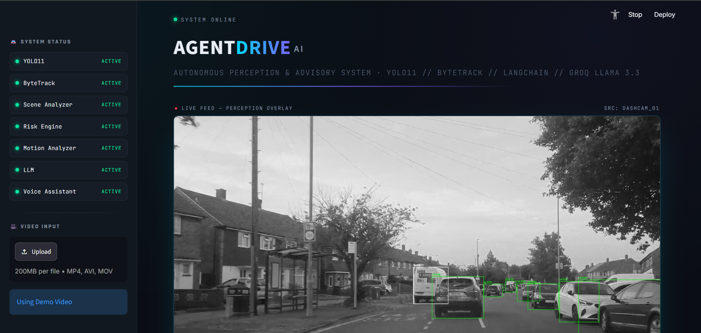
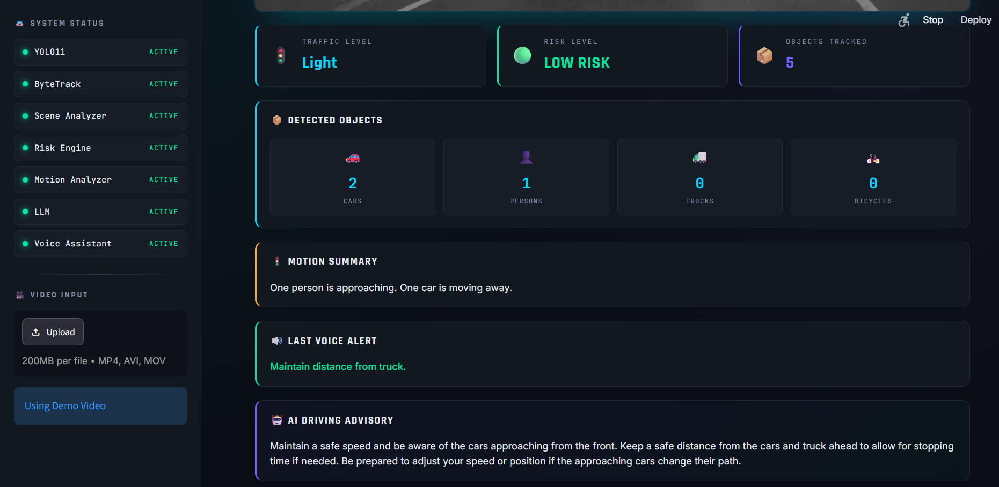
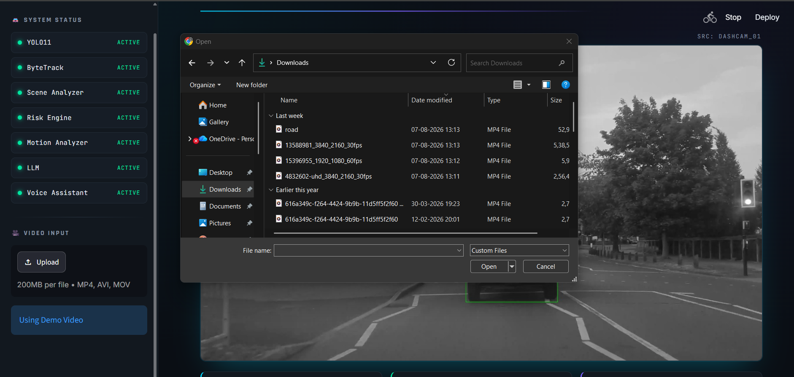
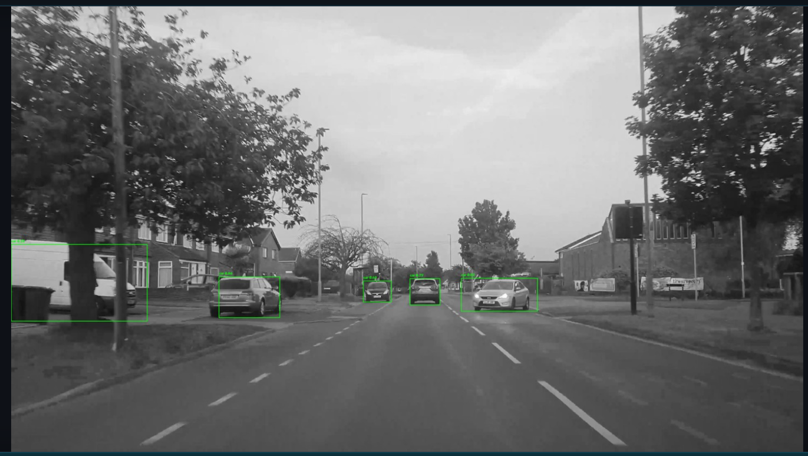

# 🚗 AgentDrive AI

<p align="center">



</p>
## 🚀 Live Demo

🌐 **Try AgentDrive AI here:**

**https://chethan-agentdrive-ai.streamlit.app/**

> Upload a driving video to experience real-time object detection, motion analysis, AI-powered driving advice, and intelligent risk assessment.

<p align="center">


</p>

---

# 📌 Overview

**AgentDrive AI** is an intelligent Driver Assistance System (ADAS) prototype that combines **Computer Vision**, **Multi-Object Tracking**, **Scene Understanding**, **Risk Analysis**, **Generative AI**, and **Neural Voice Alerts** into a real-time dashboard.

The application detects road users from a driving video, tracks them across frames, evaluates traffic conditions, estimates driving risk, generates contextual driving advice using an LLM, and delivers concise voice alerts similar to modern Advanced Driver Assistance Systems.

Unlike a conventional object detection project, AgentDrive AI integrates perception, reasoning, and driver interaction into a single modular AI system.

---

# ✨ Features

- 🚗 Real-Time Object Detection using **YOLO11**
- 🎯 Multi-Object Tracking using **ByteTrack**
- 🚦 Traffic Density Analysis
- 👥 Pedestrian Detection
- 🚛 Vehicle Detection
- 📈 Motion Analysis
- ⚠ Risk Assessment Engine
- 🤖 AI Driving Advisory using **Llama 3.3 (Groq)**
- 🔊 Neural Voice Alerts using **Microsoft Edge TTS**
- 📤 Upload Any Driving Video
- 🖥 Premium Streamlit Dashboard
- 📊 Live Telemetry Cards
- 🧠 Modular AI Pipeline

---

# 🏗️ System Architecture

```text
                    Driving Video
                          │
                          ▼
                   OpenCV Video Reader
                          │
                          ▼
                 YOLO11 Object Detection
                          │
                          ▼
              ByteTrack Object Tracking
                          │
                          ▼
                 Scene Analyzer Module
                          │
             ┌────────────┴────────────┐
             ▼                         ▼
     Motion Analyzer            Risk Engine
             │                         │
             └────────────┬────────────┘
                          ▼
                 Decision Engine
                          │
          ┌───────────────┴───────────────┐
          ▼                               ▼
   Alert Engine                     LLM Assistant
          │                               │
          ▼                               ▼
 Microsoft Edge TTS            AI Driving Advisory
          │                               │
          └───────────────┬───────────────┘
                          ▼
                 Streamlit Dashboard
```

---

# 🖥 Dashboard

## Main Dashboard


---

## AI Voice Assistant



---

## Upload Custom Video



---

## Detection Example



---

# 🧠 AI Pipeline

The project follows a modular pipeline architecture.

| Module | Responsibility |
|---------|----------------|
| YOLO11 | Object Detection |
| ByteTrack | Object Tracking |
| Scene Analyzer | Scene Understanding |
| Motion Analyzer | Movement Estimation |
| Risk Engine | Collision Risk Analysis |
| Decision Engine | Determines whether to invoke the LLM |
| Alert Engine | Generates short safety alerts |
| Voice Agent | Neural voice notifications |
| LLM Assistant | Generates contextual driving advice |

---

# 🛠 Tech Stack

## Programming

- Python 3.12

---

## Computer Vision

- OpenCV
- YOLO11 (Ultralytics)

---

## Multi Object Tracking

- ByteTrack

---

## Generative AI

- LangChain
- Groq API
- Llama 3.3

---

## Voice AI

- Microsoft Edge TTS
- pygame

---

## Dashboard

- Streamlit

---

# 📂 Project Structure

```text
AI_Driving_Assistant/

│

├── app.py
├── requirements.txt
├── README.md

│

├── assets/
│   ├── dashboard.png
│   ├── upload.png
│   ├── voice.png
│   └── detection.png

│

├── videos/

│

└── src/

    ├── detector.py
    ├── visualizer.py
    ├── scene_analyzer.py
    ├── motion_analyzer.py
    ├── risk_engine.py
    ├── decision_engine.py
    ├── alert_engine.py
    ├── voice_agent.py
    ├── llm_assistant.py
    ├── memory.py
    └── pipeline.py
```

---

# 🚀 Installation

Clone the repository

```bash
git clone https://github.com/ChethanMShivappa/AgentDrive-AI.git
```

Navigate into the project

```bash
cd AgentDrive-AI
```

Create a virtual environment

```bash
python -m venv venv
```

Activate

Windows

```bash
venv\Scripts\activate
```

Install dependencies

```bash
pip install -r requirements.txt
```

Run

```bash
streamlit run app.py
```

---

# 🎯 Example Output

### Traffic Level

```
HEAVY
```

### Risk Level

```
MEDIUM
```

### Motion Summary

```
2 Cars Approaching

1 Truck Moving Away
```

### Voice Alert

```
⚠ Heavy Vehicle Ahead
```

### AI Driving Advisory

```
Reduce speed.

Maintain a safe following distance.

Watch pedestrians crossing ahead.
```

---

# 📈 Future Enhancements

- Lane Detection
- Traffic Sign Recognition
- Driver Drowsiness Detection
- Depth Estimation
- Speed Estimation
- Collision Prediction
- Voice Commands
- Edge Device Deployment
- Docker Support
- Cloud Deployment

---

# 💼 Skills Demonstrated

- Computer Vision
- Multi-Object Tracking
- Scene Understanding
- Motion Analysis
- Risk Assessment
- Prompt Engineering
- Large Language Models
- LangChain
- Real-Time Video Analytics
- Software Engineering
- Modular AI System Design
- Streamlit Dashboard Development

---

# 👨‍💻 Author

**Chethan M S**

AI Engineer | Generative AI | Computer Vision | Agentic AI

GitHub:
https://github.com/ChethanMShivappa

LinkedIn:
https://linkedin.com/in/chethan-m-s-b544673a9/

---

# ⭐ Support

If you found this project useful, please consider giving it a ⭐ on GitHub.